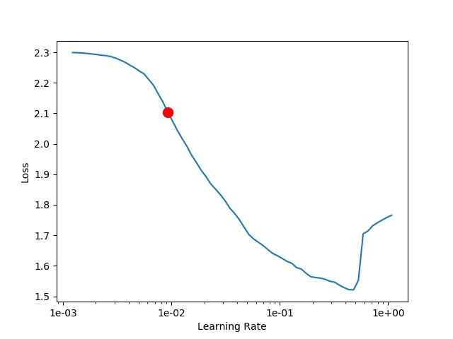

# Deep Learning Template in PyTorch

## Features
1. Easy distributed training.
```bash
trainer=Trainer(...)
trainer.to_distributed()
trainer.fit()
```
2. Easy distributed inference.
```bash
trainer=Trainer(...)
trainer.to_distributed()
trainer.get_preds()
```
3. Learning-rate finder helps you find best learning rate.
```bash
trainer=Trainer(...)
trainer.find_lr()
```



### Install

1. install PyTorch according to https://pytorch.org/
2. pip install -r requirements.txt
3. sh build_and_install.sh

## Training and inference example for MNIST 
1. Find learning-rate.
```bash
python train_net.py --config-file configs/mnist/defaults.yaml --mode findlr
```

2. Training.
```bash
# single gpu
python train_net.py --config-file configs/mnist/defaults.yaml --num-gpus 1
```
```bash
# multi-gpu distributed training.
python train_net.py --config-file configs/mnist/defaults.yaml --num-gpus 4
```
2. Inference and evaluation.
```bash
# single gpu
python train_net.py --config-file configs/mnist/defaults.yaml --mode eval --num-gpus 1
```
```bash
# multi-gpu distributed inference.
python train_net.py --config-file configs/mnist/defaults.yaml --mode eval --num-gpus 4
```

## Extend by your own dataset.

1. Configs

2. Dataset

   1. Override torch.utils.dataset.Dataset

      Create a new Python file in deep_learning_template/data/datasets.

      The dataset must accept ds_len and transforms as parameter at least.

   2. Register

      Add in deep_learning_template/data/datasets/\__init__.py

   3. Define in PathCatalog:deep_learning_template/config/paths_catalog.py

      Add in **DATASET**.

      Add in **get** method.

3. Trainer

   Add a new file in deep_learning_template/trainer.

   Register in deep_learning_template/trainer/build.py

4. Loss

   Define in deep_learning_template/loss/build.py

5. Metrics

   Add new file in deep_learning_template/metric.

   Register in deep_learning_template/metric/build.py

6. Model

   Add new file in deep_learning_template/modeling/models.

   Register in deep_learning_template/modeling/models/models.py

   All models must accept cfg as parameter only.

7. Evaluator

   Define in deep_learning_template/evaluators/build.py

